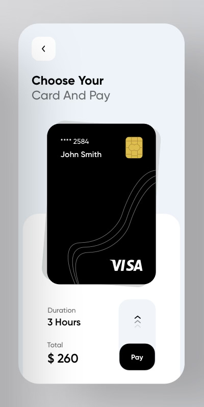

# Tech intern test

## Preamble

Considering the high number of candidates with same level of experience (and lack of experience) I decided to ask for a "small" technical test with the remaining ones. As an experienced developer this test (without the optional/bonus features) took me 45mn. You will certainly use more time, which is completely normal. I don't expect a perfect app, this test is here to assess what you can already do, what is missing, your motivation and the respect of the instructions.

## Evaluation

- I will clone the repo, install the dependency with npm and use "ng serve"
- I will look at the comments, the commits, the architecture of the app
- Try to be independant but if you have any question or need help (as if the intership has started) write to me (joris@rumble.studio) with the subject `[tech intern][evaluation] <a significant title>`
- Send me your repo link as soon as possible (event not finished) and in any case before Monday, November 30, 2020, 11 a.m CET (=Paris time). 
- I will compare your work on the same day and send a feedback by December 1st at the latest. 

## Mission:

Build an Angular app

Requirements:
- Angular Version: 11
- Simple app routing module with 3 pages: homepage, data, settings
- one navbar at the top with links to the 3 pages
- Welcome page (CSS exercice):
    - Implement the design in this image:
    
    - the black button must be an independant component accepting the text as an input ("Pay" being the default value) and emitting its boolean state on change (false, true).
    - the black button does not need to be "draggable" (**bonus** it would be nice if you have time to do it using [Angular CDK Drag-drop](https://material.angular.io/cdk/drag-drop/overview#restricting-movement-within-an-element))
- Data page (firebase exercice): Create a synced list of urls 
    - the page must show a form accepting two inputs ('name' and 'url') and one submit button
    - On form submit: save the two values on Firebase firestore in a collection called 'savedUrls'
        - **bonus**: validate the url format with a "form controller"
        - **bonus**: pipe the firebase request with a delay to show a "processing request" animation
    - the page must show the content of the firebase collection 'savedUrls' with a delete button on the right and a clickable link to open the URLs
- Settings page (**optional...**): 
    - surprise me! (ideas: call to a cloud function of your own, custom HTML5 audio player, data analytics component, PWA demo, a Dribbble CSS implementation, a dev challenge, a webRTC usage, a Flask Docker, use of an interesting library....)

- Push everything on a public repository
- Don't forget to comment and lint your code
- Don't hesitate to add references in comments to Stack Overflow questions if you used some
- Use "git commit" a lot so that I can follow the dev process
- **Bonus** The app can be deployed via firebase or a service of your choice

